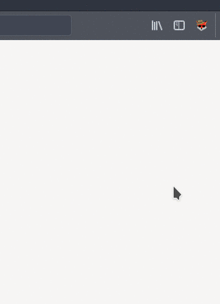
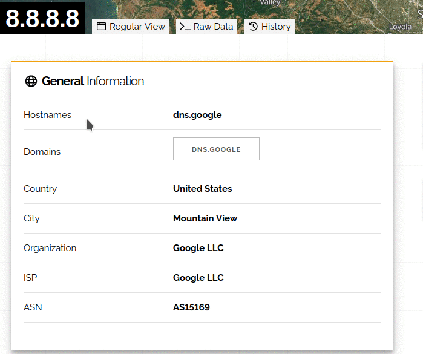

  

  

# FoxyRecon
FoxyRecon is a Firefox add-on that helps you to carry out searching and investigation activities by using free Open Source Intelligence Source (OSINT) web resources.

You can perform researches through FoxyRecon in two ways:
- Via popup\
  You can enter the indicator you want to analyze in the textbox located in the popup. FoxyRecon will suggest you the most suitable tools for your indicator.\
  
- Via context menu\
  On whatever website you are visiting, you can highlight the indicator you want to analyze and, by right clicking on it, you can choose one of the suggested tools in the FoxyRecon context menu.\
  
  
  
## Features
Currently, FoxyRecon provides support for the following indicators type:
- Domains
- IPv4 addresses
- URLs
- File Hashes

The following web resources are included in FoxyRecon:
|Tool|Domain|IP|URL|Hash|
|----|:-:|:-:|:-:|:-:|
|[URLVoid](https://urlvoid.com/)|:heavy_check_mark:| - | - | - |
|[Urlscan](https://urlscan.io/)|:heavy_check_mark:| - | - | - |
|[Hurricane Electric BGP Toolkit](https://bgp.he.net/)|:heavy_check_mark:|:heavy_check_mark:| - | - |
|[Domain Tools](https://whois.domaintools.com/)|:heavy_check_mark:| - | - | - |
|[URLhaus](https://urlhaus.abuse.ch/)|:heavy_check_mark:|:heavy_check_mark:|:heavy_check_mark:| - |
|[AbuseIPDB](https://www.abuseipdb.com/)|:heavy_check_mark:|:heavy_check_mark:| - | - |
|[Talos Intelligence](https://talosintelligence.com/)|:heavy_check_mark:|:heavy_check_mark:| - | - |
|[crt.sh](https://crt.sh/)|:heavy_check_mark:| - | - | - |
|[VirusTotal](https://virustotal.com/)|:heavy_check_mark:|:heavy_check_mark:| - |:heavy_check_mark:|
|[hashdd](https://www.hashdd.com/)| - | - | - |:heavy_check_mark:|
|[MALWARE bazaar](https://bazaar.abuse.ch/)| - | - | - |:heavy_check_mark:|
|[THREATfox](https://threatfox.abuse.ch/)|:heavy_check_mark:|:heavy_check_mark:| - |:heavy_check_mark:|
|[AlienVault](https://otx.alienvault.com/)|:heavy_check_mark:|:heavy_check_mark:| - |:heavy_check_mark:|
|[HybridAnalysis](https://www.hybrid-analysis.com/)| - | - | - |:heavy_check_mark:|
|[Kaspersky](https://opentip.kaspersky.com/)|:heavy_check_mark:|:heavy_check_mark:| - |:heavy_check_mark:|
|[Pulsedive](https://pulsedive.com/)|:heavy_check_mark:|:heavy_check_mark:| - |:heavy_check_mark:|
|[IntelligenceX](https://intelx.io/)|:heavy_check_mark:|:heavy_check_mark:| - | - |
|[Norton Safeweb](https://safeweb.norton.com/)|:heavy_check_mark:| - |:heavy_check_mark:| - |
|[Alexa](https://www.alexa.com/)|:heavy_check_mark:| - | - | - |
|[Spyse](https://spyse.com/)|:heavy_check_mark:|:heavy_check_mark:| - | - |
|[WebArchive](https://web.archive.org)| - | - |:heavy_check_mark:| - |
|[Google Cache](https://webcache.googleusercontent.com)| - | - |:heavy_check_mark:| - |
|[Host.io](https://host.io/)|:heavy_check_mark:| - | - | - |
|[Shodan](https://www.shodan.io/)|:heavy_check_mark:|:heavy_check_mark:| - | - |
|[Censys](https://censys.io/)|:heavy_check_mark:| - | - | - |
