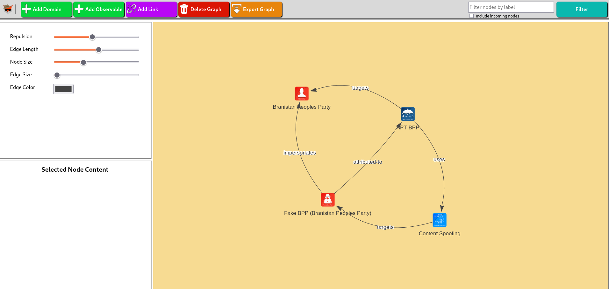

  

  

# FoxyRecon
FoxyRecon is a Firefox add-on that helps you to carry out searching and investigation activities by using over 90 Open Source Intelligence Source (OSINT) web resources.

 

## Main Features

- You can research and analyse your indicators on more than 90 online OSINT resources, by using the popup or the context menu after selecting your indicator. FoxyRecon will detect the type of the indicator you submitted and suggest you the most suitable web resources.
- You can harvest and collect all the indicators that are present on the web page you are visiting. FoxyRecon allows you also to download them in CSV file for future analysis. See the wiki page for more information (https://github.com/vincenzocaputo/FoxyRecon/wiki/5.-Collecting-Indicators).
- You can add custom resources to FoxyRecon, for example local tools (e.g.: MISP, OpenCTI and so on)
- You can create a graph from the data collected during your investigation analysis. Graphs are based on STIX format to ensure compatibility with other tools. Moreover, FoxyRecon is able to automatically create graphs on the basis of searches you perform via FoxyRecon

## Supported Indicators
Currently, FoxyRecon supports the following indicator types:
- Domains
- IPv4 addresses
- URLs
- File Hashes
- Email addresses
- CVEs
- Phone numbers
- Autonomous System Numbers

## Search filters
FoxyRecon provides some feature that can make analysis activities more efficient and comfortable:
- Search web resources by tool and information type provided:
    - Reputation Lookup [rep]
    - Whois information Lookup
    - DNS information Lookup
    - SSL/TLS certificate Lookup
    - Sandbox utility
    - Data Leak lookup
    - Screenshot taker
    - IoCs sharing platform
    - Historical information
    - Open ports passive scanning utility
    - HTTP Headers checker utility
    - Network activities information
- Filter web resources by name using the special character "!" in the search bar (e.g.: "example.com !abuse)
- Choose your favourite tools and display only those by using the "star" button

#### Custom Web Resources
You can add your custom tools to FoxyRecon using the dedicated page reachable from settings.

## Web Resources
FoxyRecon includes a plenty of OSINT web resources. You can find the full list [here](https://github.com/vincenzocaputo/FoxyRecon/wiki/3.-Web-Resources).

You can also add your custom web resource sing the dedicated page reachable from settings.

## Disclaimer
FoxyRecon does not retain any user data. Data submitted using this add-on will be sent to external web resources that are not under control of FoxyRecon. For this reason the data submitted will be treated in accordance with the terms of service of the several web resources chosen for analysis. Please, be aware of the tools and resources you are using and do not submit any personal information.

This addon is *experimental* and it may contain some bugs. Feel free to open issues if you have questions, insights or bugs to report. 
