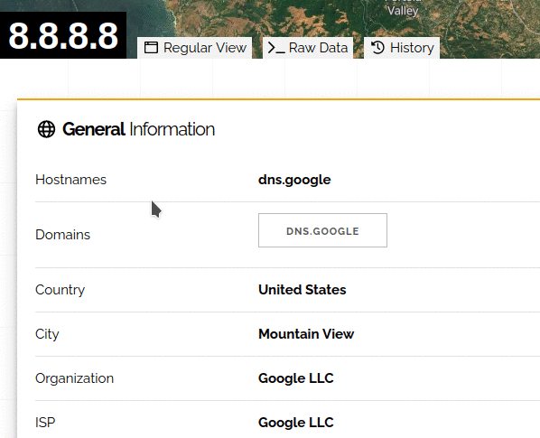

 

  

  

# FoxyRecon
FoxyRecon is a Firefox add-on that helps you to carry out searching and investigation activities by using free Open Source Intelligence Source (OSINT) web resources.

## Usage

You can perform researches through FoxyRecon in two ways:
- Via popup\
  You can enter the indicator you want to analyze in the textbox located in the popup. FoxyRecon will suggest you the most suitable tools for your indicator.\
  
- Via context menu\
  On whatever website you are visiting, you can highlight the indicator you want to analyze and, by right clicking on it, you can choose one of the suggested tools in the FoxyRecon context menu.
  The indicator submitted will be saved as input in the text field of the popup in order to let you performing further investigations on it. \
  
  
  
## Features
### Investigation
Currently, FoxyRecon supports the following indicator types:
- Domains
- IPv4 addresses
- URLs
- File Hashes
- Email addresses
- CVEs :new:

The following web resources are included in FoxyRecon:
|Tool|Domain|IP|URL|Hash|Email|CVE|
|----|:-:|:-:|:-:|:-:|:-:|:-:|
|[URLVoid](https://urlvoid.com/)|:heavy_check_mark:| - | - | - | - | - |
|[Urlscan](https://urlscan.io/)|:heavy_check_mark:| :heavy_check_mark: | :heavy_check_mark: | - | - | - |
|[Urlscan Liveshot](https://urlscan.io/)| - | :heavy_check_mark: | :heavy_check_mark: | - | - | - |
|[Hurricane Electric BGP Toolkit](https://bgp.he.net/)|:heavy_check_mark:|:heavy_check_mark:| - | - | - | - |
|[Domain Tools](https://whois.domaintools.com/)|:heavy_check_mark:| - | - | - | - | - |
|[URLhaus](https://urlhaus.abuse.ch/)|:heavy_check_mark:|:heavy_check_mark:|:heavy_check_mark:| - | - | - |
|[AbuseIPDB](https://www.abuseipdb.com/)|:heavy_check_mark:|:heavy_check_mark:| - | - | - | - |
|[Talos Intelligence](https://talosintelligence.com/)|:heavy_check_mark:|:heavy_check_mark:| - | - | - | - |
|[crt.sh](https://crt.sh/)|:heavy_check_mark:| - | - | - | - | - |
|[VirusTotal](https://virustotal.com/)|:heavy_check_mark:|:heavy_check_mark:|:heavy_check_mark: :red_circle:|:heavy_check_mark:| - | - |
|[hashdd](https://www.hashdd.com/)| - | - | - |:heavy_check_mark:| - | - |
|[MALWARE bazaar](https://bazaar.abuse.ch/)| - | - | - |:heavy_check_mark:| - | - |
|[THREATfox](https://threatfox.abuse.ch/)|:heavy_check_mark:|:heavy_check_mark:| - |:heavy_check_mark:| - | - |
|[AlienVault](https://otx.alienvault.com/)|:heavy_check_mark:|:heavy_check_mark:| - |:heavy_check_mark:| - | - |
|[HybridAnalysis](https://www.hybrid-analysis.com/)| - | - | - |:heavy_check_mark:| - | - |
|[Kaspersky](https://opentip.kaspersky.com/)|:heavy_check_mark:|:heavy_check_mark:| - |:heavy_check_mark:| - | :heavy_check_mark: |
|[Pulsedive](https://pulsedive.com/)|:heavy_check_mark:|:heavy_check_mark:| - |:heavy_check_mark:| - | - |
|[IntelligenceX](https://intelx.io/)|:heavy_check_mark:|:heavy_check_mark:| - | - | :heavy_check_mark: | - |
|[Norton Safeweb](https://safeweb.norton.com/)|:heavy_check_mark:| - |:heavy_check_mark:| - | - | - |
|[Alexa](https://www.alexa.com/)|:heavy_check_mark:| - | - | - | - | - |
|[Spyse](https://spyse.com/)|:heavy_check_mark:|:heavy_check_mark:| - | - | - | - |
|[WebArchive](https://web.archive.org)| - | - |:heavy_check_mark:| - | - | - |
|[Google Cache](https://webcache.googleusercontent.com)| - | - |:heavy_check_mark:| - | - | - |
|[Host.io](https://host.io/)|:heavy_check_mark:| - | - | - | - | - |
|[Shodan](https://www.shodan.io/)|:heavy_check_mark:|:heavy_check_mark:| - | - | - | - |
|[Censys](https://censys.io/)|:heavy_check_mark:|:heavy_check_mark:| - | - | - | - |
|[Threatcrowd](https://www.threatcrowd.org/)|:heavy_check_mark:|:heavy_check_mark:| - | - | :heavy_check_mark: | - |
|[Checkphish Lookup](https://checkphish.ai/)|:heavy_check_mark:|:heavy_check_mark:| - | - | - | - |
|[Checkphish Scan](https://checkphish.ai/)|:heavy_check_mark:| - | :heavy_check_mark: | - | - | - |
|[ViewDNS WHOIS](https://viewdns.info/)|:heavy_check_mark:| :heavy_check_mark: | - | - | - | - |
|[ViewDNS DNS Lookup](https://viewdns.info/)|:heavy_check_mark:| - | - | - | - | - |
|[ViewDNS HTTP Headers](https://viewdns.info/)|:heavy_check_mark:| - | - | - | - | - |
|[Netcraft Site Report](https://sitereport.netcraft.com)|:heavy_check_mark:| - | :heavy_check_mark: | - | - | - |
|[dnsdumpster](https://dnsdumpster.com) :red_circle:|:heavy_check_mark:| - | - | - | - | - |
|[Have I Been Pwned](https://haveibeenpwned.com/) :red_circle:| - | - | - | - | :heavy_check_mark: | - |
|[Hunter](https://hunter.io/) | - | - | - | - | :heavy_check_mark: | - |
|[CentralOps](https://centralops.net) :red_circle:| :heavy_check_mark: | - | - | - | :heavy_check_mark: | - |
|[Dehashed](https://dehashed.com/) :red_circle:| - | - | - | - | :heavy_check_mark: | - |
|[EmailRep](https://emailrep.io/) | - | - | - | - | :heavy_check_mark: | - |
|[SecurityTrails](https://securitytrails.com/) | :heavy_check_mark: | :heavy_check_mark: | - | - | - | - |
|[Spamhaus](https://check.spamhaus.org/) | :heavy_check_mark: | :heavy_check_mark: | - | - | - | - |
|[JoeSandbox](https://www.joesandbox.com) | - | - | - | :heavy_check_mark: | - | - |
|[ZoomEye](https://www.zoomeye.org/) | :heavy_check_mark: | :heavy_check_mark: | - | - | - | - |
|[Intezer Analyze](https://analyze.intezer.com)| - | - | - | :heavy_check_mark: | - | - |
|[Urlscan Public Scan](https://urlscan.io) | - | - | :heavy_check_mark: | - | - | - |
|[Urlscan Unlisted Scan](https://urlscan.io)| - | - | :heavy_check_mark: | - | - | - |
|[Urlscan Private Scan](https://urlscan.io)| - | - | :heavy_check_mark: | - | - | - |
|[BuiltWith](https://builtwith.com) | :heavy_check_mark: | - | - | - | - | - |
|[URLVoid](https://urlvoid.com/whois)  |:heavy_check_mark:| - | - | - | - | - |
|[Whois](https://whois.com/whois)  |:heavy_check_mark:| :heavy_check_mark: | - | - | - | - |
|[EuroDNS](https://www.eurodns.com)  |:heavy_check_mark:| - | - | - | - | - |
|[IANA](https://www.iana.org/whois)  |:heavy_check_mark:| :heavy_check_mark: | - | - | - | - |
|[MX ToolBox Blacklist](https://mxtoolbox.com)  |:heavy_check_mark:| :heavy_check_mark: | - | - | - | - |
|[MX ToolBox DNS Lookup](https://mxtoolbox.com)  |:heavy_check_mark:| - | - | - | - | - |
|[MX ToolBox WHOIS](https://mxtoolbox.com)  |:heavy_check_mark:| - | - | - | - | - |
|[CVE Mitre](https://cve.mitre.org) | - | - | - | - | - | :heavy_check_mark: |
|[Fortiguard](https://www.fortiguard.com) | - | - | - | - | - | :heavy_check_mark: |
|[GitHub](https://github.com) | - | - | - | - | - | :heavy_check_mark: |
|[NIST](https://nvd.nist.gov) | - | - | - | - | - | :heavy_check_mark: |
|[Vulmon](https://vulmon.com) | - | - | - | - | - | :heavy_check_mark: |
|[Greynoise](https://greynoise.io) :new: | - | :heavy_check_mark: | - | - | - | - |
|[AttackerKB](https://attackerkb.com) :new: | - | - | - | - | - | :heavy_check_mark: |
|[CVE report](https://cve.report) :new: | - | - | - | - | - | :heavy_check_mark: |
|[Tenable](https://tenable.com)  :new: | - | - | - | - | - | :heavy_check_mark: |
|[Vulners](https://vulners.com) :new: | - | - | - | - | - | :heavy_check_mark: |
|[Google](https://google.com) :new: | :heavy_check_mark: | :heavy_check_mark: | - | - | :heavy_check_mark: | :heavy_check_mark: |

:red_circle: These web tools require some user interactions, such as entering a query and clicking a button to submit it. To perform these actions faster, FoxyRecon will automatically fill input fields on this web pages, with the indicator you are looking for.

### Hunting :new:
FoxyRecon let you pull out indicators from a web page, making them ready for investigations and analysis.

## Disclaimer
Data submitted using this add-on will be sent to external web resources that are not under control of FoxyRecon. For this reason the data submitted will be treated in accordance with the terms of service of the several web resources chosen for analysis. Please, be aware of the tools and resources you are using and do not submit any personal information.
